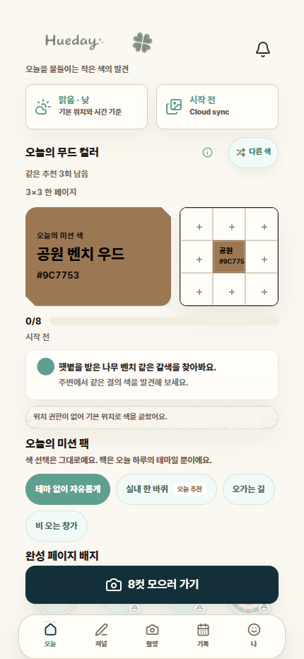
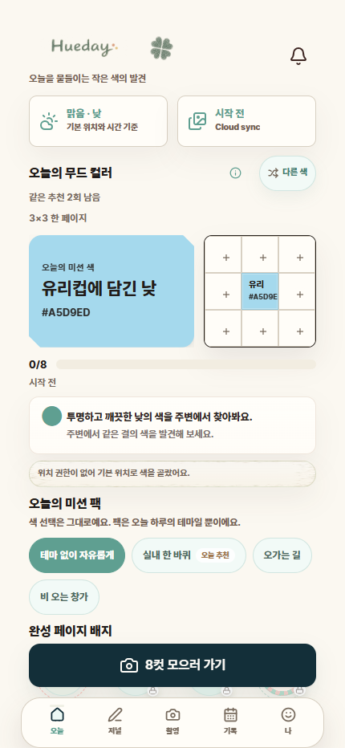
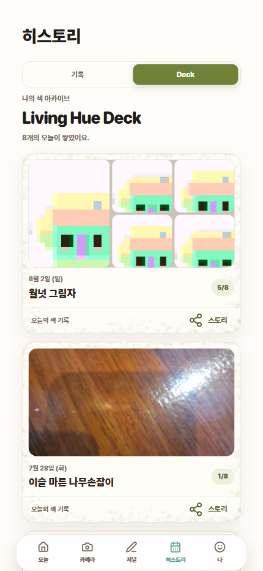
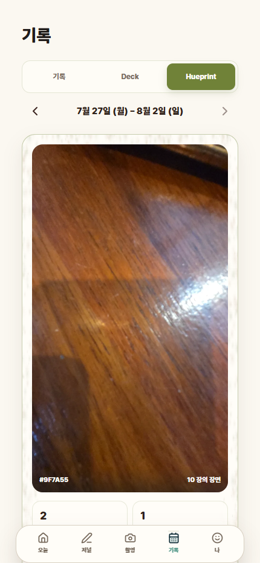
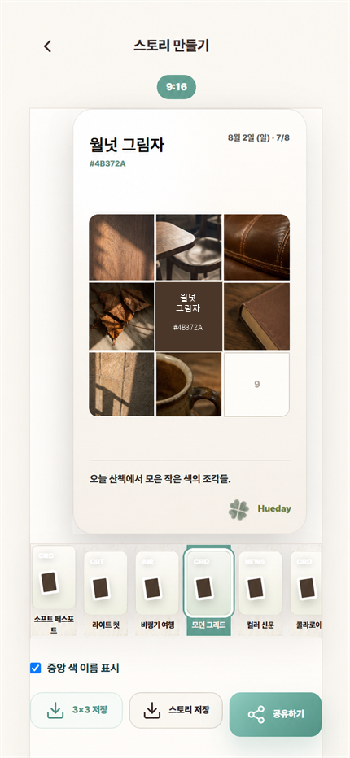
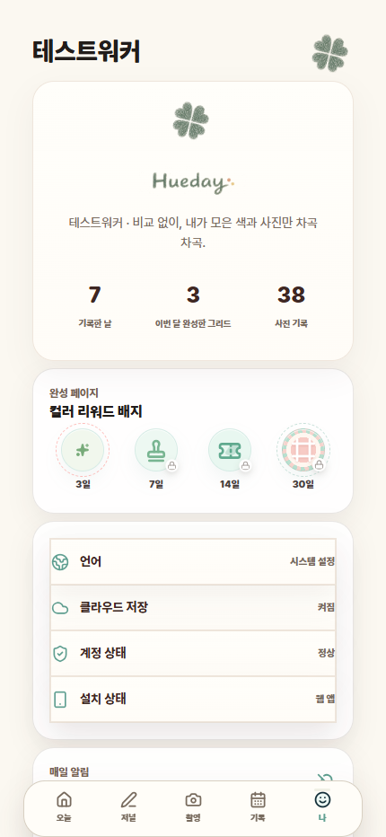
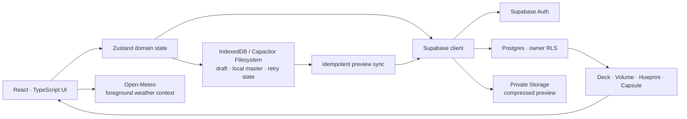

<div align="center">
  
  <h1>일상에서 오늘의 색을 발견하는 컬러 다이어리</h1>
  <p>
    날씨와 시간에 어울리는 색을 받고, 주변에서 비슷한 색을 찾아<br/>
    나만의 3×3 페이지와 색 아카이브를 만드는 개인 기록 서비스입니다.
  </p>
  <p>
    <a href="https://colorwalk-tau.vercel.app"><strong>Web Beta</strong></a>
    · React PWA
    · Capacitor Android
    · Korean / English
  </p>
</div>

> **현재 상태** — 핵심 제품 기능과 M6 통합 디자인까지 구현했고, `M6.5` 실제 화면·제품 카피 마감과 `M7` Android 실기기·보안·Google Play 출시 검증을 진행하고 있습니다. Web Beta는 현재 production 기준선을 제공합니다.

## 프로젝트 개요

| 항목 | 내용 |
| --- | --- |
| 프로젝트 | Hueday (`ColorWalk` 저장소) |
| 형태 | 개인 프로젝트 · 제품 기획, UX/UI, 프론트엔드, 백엔드 연동, QA |
| 문제 | 사진 SNS의 비교 피로 없이 일상을 다시 관찰하고 꾸준히 기록할 동기가 필요함 |
| 해결 | 매일 하나의 색을 제안하고 실제 환경에서 비슷한 색을 발견하게 하는 camera-first 기록 루프 |
| 핵심 차별점 | 색 추천 → 현실의 색 발견 → 중앙색 3×3 → Deck/Hueprint 성장 → Story 공유가 하나의 데이터로 연결됨 |
| 출시 방향 | 한국어·영어 PWA/Android, 개인 비공개 기록 우선, 소셜 기능은 출시 후 검증 기반 도입 |

Hueday는 사진을 잘 찍거나 많은 반응을 얻는 경쟁 대신, **오늘 평소에 지나쳤던 색 하나를 발견하는 행동**을 반복하게 만듭니다. 1~7장도 유효한 하루 기록으로 보존하고, 8장을 모으면 중앙 미션 색을 포함한 3×3 한 페이지가 완성됩니다. 연속 출석을 놓쳤을 때의 벌점이나 실패 표현은 사용하지 않습니다.

## 실제 실행 화면

> **프로토타입 UI · 최종 QA 전** — Home·색 재추천·Deck·Hueprint·Profile은 `feature/pre-m7-visual-product-polish` 최신 코드를 430×932 로컬 브라우저에서 직접 실행한 화면입니다. Story는 같은 최신 UI 캡처에서 픽셀 fixture만 개인정보 없는 실사형 컬러워크 예시 사진으로 교체한 시각 프로토타입이며, 실제 사용자 사진이나 QA 통과 증거가 아닙니다. 아직 `main` 병합·production 배포·최종 기기 QA 전이라 출시 화면은 달라질 수 있습니다.

<table>
  <tr>
    <td align="center"><br/><sub>날씨·시간 기반 오늘의 색</sub></td>
    <td align="center"><br/><sub>문맥 추천 3회 + 중복 없는 무작위 3회</sub></td>
    <td align="center"><br/><sub>1/3/5/8장에 따라 성장하는 Deck</sub></td>
  </tr>
  <tr>
    <td align="center"><br/><sub>주간 색 기록 Hueprint</sub></td>
    <td align="center"><br/><sub>실사형 컬러워크 예시를 넣은 9:16 Story</sub></td>
    <td align="center"><br/><sub>기록 통계·언어·동기화 상태</sub></td>
  </tr>
</table>

## 핵심 사용자 경험

### 1. Daily Color Hunt

- 날씨·시간·foreground 대략 위치를 바탕으로 첫 색을 추천합니다.
- 첫 사진을 확정하기 전 `다른 색`을 최대 6회 선택할 수 있습니다.
  - 1~3회: 같은 환경 맥락의 추천
  - 4~6회: 그날 이미 본 색을 제외한 전체 catalog 균등 무작위
- 촬영만으로 색을 잠그지 않고 사용자가 `이 사진 사용`을 선택한 시점에 확정합니다.
- 1~7장은 부담 없는 일일 기록, 8장은 주요 보상 단위인 완성 3×3으로 구분합니다.

### 2. 일상 미션 팩

사용자는 위치 추적 없이 `테마 없이 자유롭게`, `실내 한 바퀴`, `오가는 길`, `비 오는 창가` 중 하루의 관찰 맥락을 고를 수 있습니다. 팩은 사진을 분류하는 AI가 아니라 사용자가 스스로 선택한 명시적 ID로 저장되므로 기존 기록을 억지로 추론하지 않습니다.

### 3. Living Hue Deck와 Color Volume

같은 일일 기록이 사진 수에 따라 1/3/5/8 단계의 카드로 성장합니다. 완성된 같은 `mission_hex` 기록은 Color Volume으로 모이며, 별도 카드 이미지나 테이블을 중복 저장하지 않고 원본 기록에서 파생합니다.

### 4. Hueprint와 Color Capsule

일일 기록을 주간 Hueprint와 월간 Color Capsule로 다시 보여 줍니다. 잘못된 legacy 색을 임의로 보정하지 않고 canonical mission HEX가 유효한 기록만 파생 콘텐츠에 포함해 기존 History/Story는 그대로 보존합니다.

### 5. Journal과 Story

짧은 글을 선택적으로 남기고, 3×3을 1080×1920 Story 이미지로 저장하거나 Web Share/Android native share로 전달합니다. Story 중앙의 색 이름·HEX는 사용자가 숨길 수 있으며, 원본 기록은 변경하지 않습니다.

## 시스템 설계



### Local-first 저장 경계

- 촬영 원본과 local master는 기기에 먼저 저장합니다.
- cloud에는 owner-private 압축 preview와 최소 Post metadata만 동기화합니다.
- 업로드 성공 후 Post 저장이 실패해도 기존 upload path를 재사용해 중복 업로드를 막습니다.
- 앱 재시작, 오프라인/온라인 전환, 날짜 마감에서도 로컬 최신 기록과 서버 기록을 날짜별 하나의 논리 기록으로 병합합니다.
- 동기화가 끝난 원본은 사용자가 복구 불가 경고를 확인한 경우에만 수동 정리할 수 있습니다.

### 개인정보와 보안

- Supabase Auth와 owner 기준 RLS로 Post/Storage를 사용자별로 격리합니다.
- private bucket과 짧은 signed URL을 사용하고 anonymous/cross-user 접근 거부를 자동 검증합니다.
- 사진, 저널 원문, 정확 위치, 인증 정보, signed URL은 product analytics에 넣지 않습니다.
- 위치 권한을 거부해도 기본 추천과 핵심 기록 기능을 사용할 수 있습니다.
- 공개 피드·익명 이미지 업로드·DM은 첫 출시 범위에서 제외했습니다.

## 기술적 문제 해결

### 로컬 저장과 cloud 동기화의 책임 분리

사진을 매번 cloud 원본으로 다루면 비용과 오프라인 복구 문제가 함께 커집니다. Hueday는 검증된 local master를 먼저 만든 뒤 preview만 업로드하고, `ownerId + localDate` 단위 lock과 asset ID 기반 경로 재사용으로 중복 실행과 재업로드를 막았습니다. PWA Service Worker `v3 → v4` 인플레이스 업데이트에서도 로그인, 1/8 local master, 8/8 기록, 저널과 Story가 유지되는 것을 확인했습니다.

### 파생 콘텐츠의 데이터 무결성

Deck·Hueprint·Capsule을 별도 복제 데이터로 저장하지 않고 기존 일일 기록에서 계산했습니다. 잘못된 legacy HEX를 이미지 픽셀이나 날씨로 추측해 고치지 않고, History에서는 원본을 보존하면서 파생 콘텐츠에서만 안전하게 제외했습니다.

### 실제 브라우저 QA에서 발견한 export·동시성 결함

- `html2canvas`가 CSS `color-mix()`를 해석하지 못해 Hueprint export가 실패하던 문제를 고정 배경색으로 교체했습니다.
- 빠른 화면 이동 시 analytics outbox가 같은 이벤트를 동시에 전송해 primary-key 충돌을 내던 문제를 owner별 in-flight Promise lock으로 해결했습니다.
- mission color 전체 catalog의 텍스트 대비를 검사해 모든 후보가 WCAG 4.5:1 이상이 되도록 공용 resolver에서 처리했습니다. 기존 mission HEX와 Color Volume 정체성은 바꾸지 않았습니다.

### 측정하며 단순화한 디자인 시스템

M6에서 난립하던 빈 슬롯 장식과 legacy CSS를 정리했습니다. 최종 측정 기준 CSS는 `124.25kB → 122.36kB` raw(-1.5%), `24.76kB → 24.59kB` gzip으로 줄었고, 별도 성능 패키지 없이 기존 CSS와 공용 token만 재사용했습니다.

더 자세한 의사결정·대안·검증 근거는 [문제해결 기록](./docs/career-problem-solving-log.md)에 정리했습니다.

## 품질 검증

- ESLint와 TypeScript production build
- Vitest 자동 테스트 100개(M6.5 첫 checkpoint 기준)
- Supabase live verification
  - anonymous write 차단
  - 다른 사용자 Post/Storage 접근 차단
  - owner upload·signed read
  - Post/Story/grid metadata 호환
  - product event 중복 안전성
- 430×932 핵심 사용자 흐름과 실제 1080×1920 export 확인
- 360px와 200% 확대에서 핵심 CTA·3×3·navigation 점검
- Capacitor sync와 Android debug/release build
- 실제 Android 카메라 권한, 촬영·확정, 강제 종료 후 로컬 기록 복구 QA

## 기술 스택

| 영역 | 기술 |
| --- | --- |
| Frontend | React 19, TypeScript, Vite, Tailwind CSS, Zustand |
| UI | Radix Slot, Lucide React, Sonner, CSS design tokens |
| Backend | Supabase Auth, Postgres, Row Level Security, Storage |
| Local / Native | IndexedDB, Capacitor 8, Filesystem, Local Notifications, Share |
| External | Open-Meteo Weather API |
| Export | html2canvas, Web Share API, Capacitor Share |
| Test / QA | Vitest, Testing Library, ESLint, Playwright CLI, Android Emulator |
| Delivery | Vercel PWA, Android APK/AAB build pipeline |

## 실행 방법

### 요구 환경

- Node.js
- npm
- Supabase browser environment
- Android build 시 JDK 21과 Android SDK

### 로컬 실행

```bash
npm install
npm run dev
```

`.env.local`에는 다음 browser-safe 환경 변수가 필요합니다. 실제 값과 비밀정보는 저장소에 포함하지 않습니다.

```text
VITE_SUPABASE_URL
VITE_SUPABASE_PUBLISHABLE_KEY
VITE_AUTH_EMAIL_DOMAIN
```

### 검증

```bash
npm run lint
npm test -- --run
npm run build
npm run verify:supabase
npm run cap:sync
```

## 프로젝트 구조

```text
src/
├─ components/   # Home, Camera, Journal, Deck, Story, Profile UI
├─ lib/          # mission, local-first storage, sync, analytics, export domain
├─ store/        # application state
└─ types.ts      # shared data contracts

supabase/
├─ functions/    # signup 등 server-only boundary
└─ migrations/   # owner RLS와 additive schema history

docs/
├─ ai-memory/                       # 세션 간 상태·결정·다음 작업
├─ career-problem-solving-log.md    # 수치와 대안을 포함한 트러블슈팅
├─ hueday-product-blueprint.md      # 제품 source of truth
├─ hueday-development-roadmap.md    # 단계별 구현·출시 gate
└─ security-audit.md                # 실제 보안 경계와 검증 상태
```

## 로드맵

- [x] M1 — 날짜별 Color Hunt와 1~8장 기록 계약
- [x] M2 — local-first 저장, 복구, analytics outbox
- [x] M3 — Living Hue Deck와 Color Volume
- [x] M4 — 선택형 일상 미션 팩과 pack collection
- [x] M5 — Hueprint와 Color Capsule
- [x] M6 — Modern Warm Archive 디자인·접근성·성능 통합
- [ ] **M6.5 — 실제 화면·색 이름·Story·재추천 마감 (진행 중)**
- [ ] M7 — Android 인플레이스 업데이트, 사진/위치 보안, Play 출시 검증
- [ ] 출시 후 — 결제/entitlement, Hue Canvas, invite-only Hue Drop

상세한 현재 상태와 완료 조건은 [개발 로드맵](./docs/hueday-development-roadmap.md)에서 확인할 수 있습니다.

## 개발 원칙

- 구현 편의보다 승인된 제품 계약과 기존 사용자 데이터 보존을 우선합니다.
- 큰 기능은 `feature/*` 브랜치와 검증된 한국어 checkpoint commit으로 관리합니다.
- Graphify로 관련 코드만 좁게 찾고, Obsidian-compatible AI memory에 결정과 실패를 남깁니다.
- 실제 사용자 happy path와 가능성 높은 복구 path를 우선하며, 도달 불가능한 극단 조합은 근거가 생길 때까지 보류합니다.
- 배포·마이그레이션·성능 수치는 실제 실행 결과만 기록하고 추정값을 완료처럼 쓰지 않습니다.

---

<div align="center">
  <strong>Hueday</strong><br/>
  비교 없이, 내가 모은 색과 사진만 차곡차곡.
</div>
